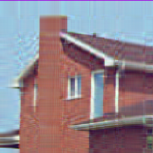
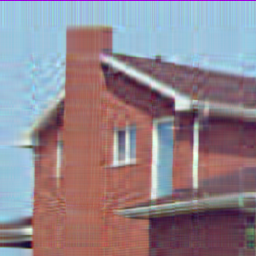
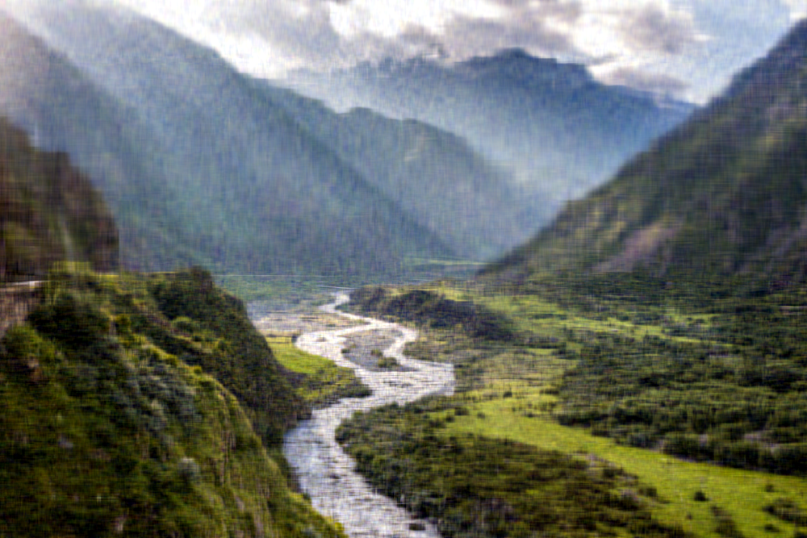
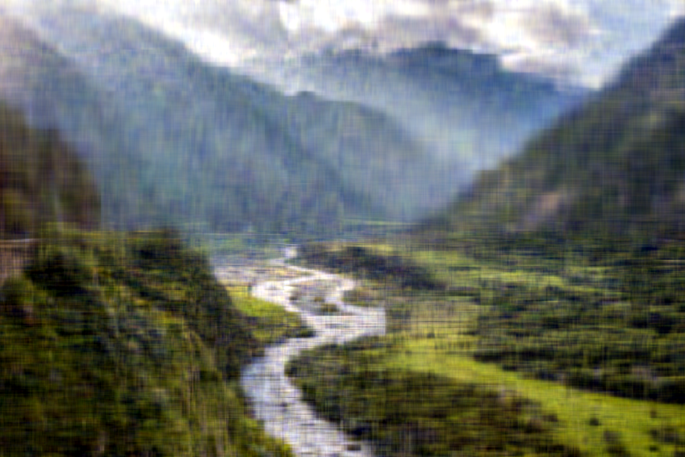
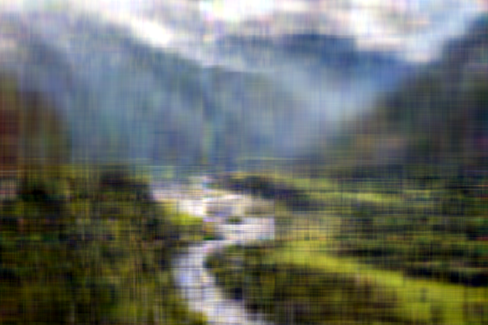
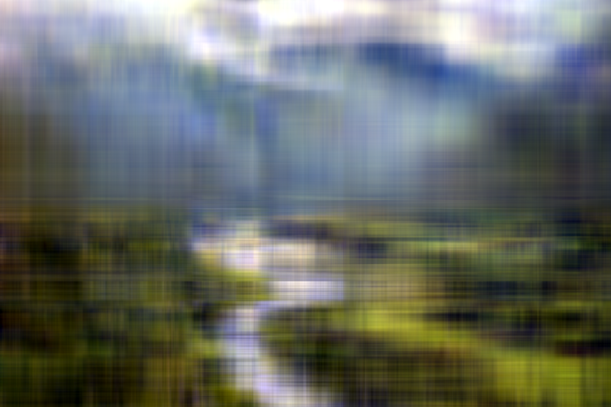
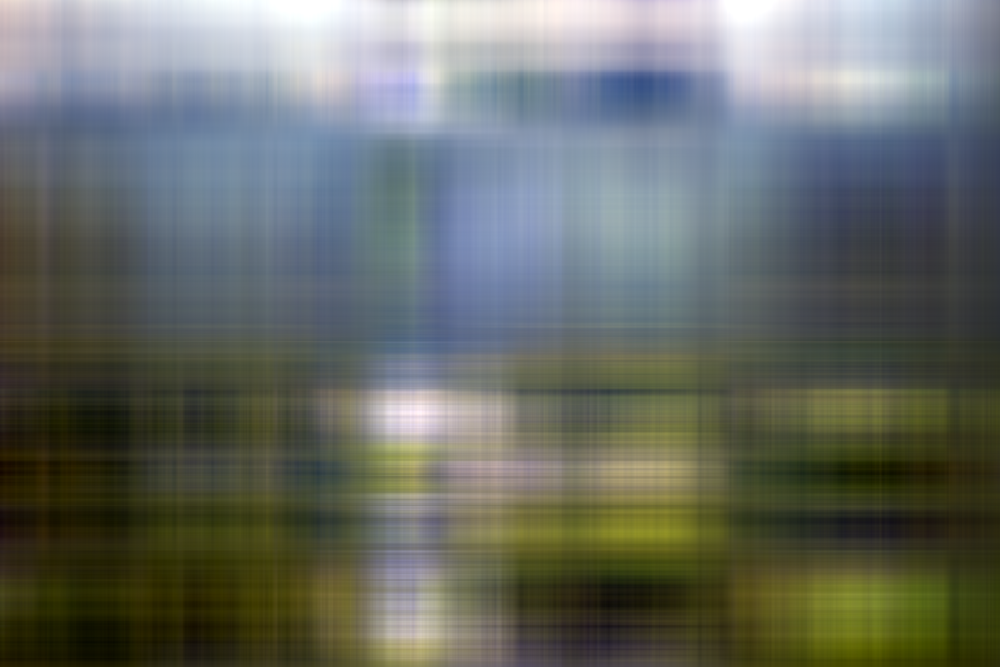

# Сингулярное разложение и сжатие изображений в формате BMP

## Описаниие
Утилита способна:
- `compress` - формировать промежуточное представление на основе исходного изображения
- `decompress` -восстановливать изображение, используя промежуточное представление

Сингулярное разложение реализовано тремя способами: 
- `numpy` -`numpy.linalg.svd(...)`
- `simple` - использует [степенной метод](https://www.jeremykun.com/2016/05/16/singular-value-decomposition-part-2-theorem-proof-algorithm/)
- `advanced` - использует [блочный степенной метод](https://www.degruyter.com/document/doi/10.1515/jisys-2018-0034/html)
## Результаты

Работа методов почти не отличается друг от друга. Например, вот разультаты сжатия в 2 раза:
| Numpy                            | Simple                            | Advanced                         |
|----------------------------------|-----------------------------------------|----------------------------------------|
|  |  |  |

А вот разультаты сжатия в 4 раза:
| Numpy                            | Simple                          | Advanced                          |
|----------------------------------|-----------------------------------------|----------------------------------------|
|  |  |  |

Теперь сожмем довольно большое(`1000 * 667`) изображение в 2, 4, 8, 16, 32 и 64 раз:
- на фото ниже результат работы `advanced` метода. С другими результатами можно ознакомиться [здесь](img/deg)
- Время работы отличалось -- самым долгим оказался метод `advanced`, самым быстрым -- `numpy`

| <!-- -->      | <!-- -->        | <!-- -->      |
|:-------------:|:---------------:|:-------------:|
|  |  |  |
|  |  |  |

## Сравнение скорости выполнения
Средние результаты за 10 запусков на изобрадении размером `1000 * 667` приведены в таблице ниже.

| compression |	Numpy	| Simple	| Advanced | 
|----------------------------------|-----------------------------------------|----------------------------------------|----------------------------------------|
| 2	| 0.98 sec	| 8.16 sec	| 3,06 sec | 
| 4	| 0.94 sec	| 5.03 sec	| 3.13 sec | 
| 8	| 0.96 sec	| 3.75 sec	| 3.05 sec | 
| 16	| 0.77 sec	| 3.30 sec	| 2.47 sec | 
| 32	| 0.73 sec	| 3.15 sec	| 0.93 sec | 

Заметим, что чем больше коэффицент сжатия, тем быстрее работает программа. А также, что при любом коэффиценте сжатия время `Simple` `>` `Advanced` `>` `Numpy`.

## Вывод

Реализованные методы достаточно корректно работают.

Методы в порядке увеличения скорости выполнения:
1. `numpy`
2. `advanced`
3. `simple`
